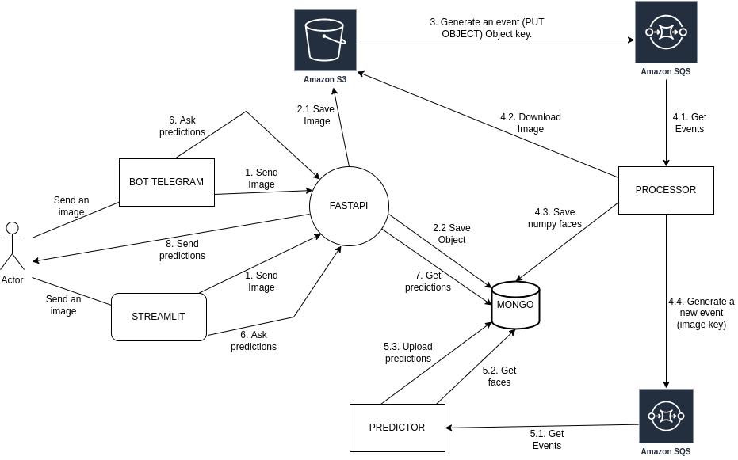
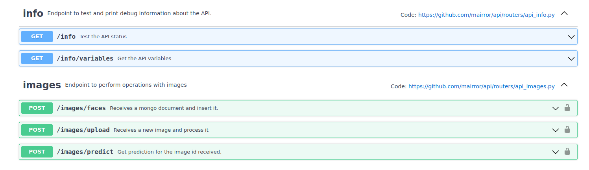
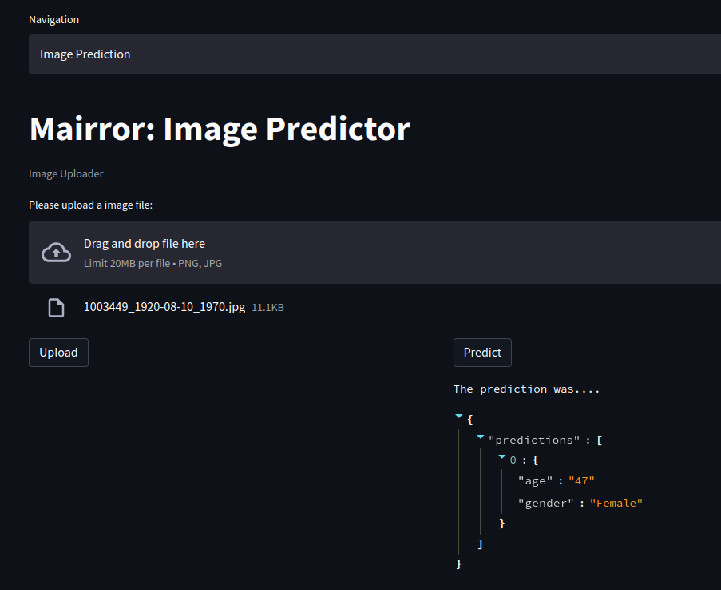

# MAIRROR
      

Mairror is a project that uses Artificial Inteligence to make predictions on the age and gender of pictures.

## Try it!


## Table of contents

<!-- START doctoc generated TOC please keep comment here to allow auto update -->
<!-- DON'T EDIT THIS SECTION, INSTEAD RE-RUN doctoc TO UPDATE -->

- [Why we did Mairror?](#why-we-did-mairror)
- [Dataset](#dataset)
- [Training](#training)
- [Applications](#applications)
- [Main Components](#main-components)
- [References](#references)
- [Credits](#credits)

<!-- END doctoc generated TOC please keep comment here to allow auto update -->

## Why we did Mairror?

This project was born from the curiosity for neural networks and artificial intelligence. Although it does not cover a basic needing that is not already available for numerous applications on the market, both free and commercial, the development of a project that brings together the skills necessary for developing ab application such as Mairror is a personal and professional challenge for the authors.

Mairror is a project that aims to put into practice the disciplines of DevOps together with Machine Learning, managing to put into production a neural network model capable of predicting the age and gender of person using a picture. This application is made available through a frontend and a Telegram bot to users, who can check first-hand the effectiveness of the training carried out in our laboratory from their own mobile devices.

Al igual que la malvada madrastra de Blancanieves preguntaba a un espejo por sus características físicas, Mairror nos permite conocer lo que piensa sobre nuestro aspecto físico un algoritmo entrenado con miles de caras.

Just as Snowwhite's wicked stepmother asked a mirror about her physical characteristics, Mairror lets us know what an algorithm trained on thousands of faces thinks about our physical appearance.

## How is Mairror done?

Mairror is an event-driven architecture that makes a Deep Learning model available to users through frontend microservices and through Telegram bots.



For its development, we have used tools from three independent disciplines: Web Development, DevOps and Machine Learning. The technologies used can be grouped into these 3 main categories.

### Languages and Libraries

| Web Development | DevOps | Machine Learning & Deep Learning |
|------|------|------|
|Python |AWS |Numpy |
|FastAPI |EKS |Pandas |
|Streamlit |Kubernetes |Jupyter Lab |
|PyTest |Helm |IPython |
|AsyncIO |Terraform |SciKit Learn |
|Boto3 |Helmfile | Tensorflow|
|Streamlit |Github actions | CUDA|
|Telegram Bot|eksctl |Tensorboard|
|Anaconda|Makefile |mtcnn|
| |Mongo Atlas|face recognition|
| |Dockerfile/docker-compose|opencv|


## Dataset 

For our first training we used the [imdb-wiki dataset](https://data.vision.ee.ethz.ch/cvl/rrothe/imdb-wiki/) which as an approximate amount of 7 Gb of images taken from Wikipedia. 

Since the wiki dataset was too heavy for the training we decided to go for the [UTKFaces dataset](https://susanqq.github.io/UTKFace/) with an approximate size of 2.1 GB.

## Training

Once we decided on the type of problem we wanted to deal with and found a suitable dataset, we proceeded with the data exploration phase.

In order to cope with such a large amount of data we decided to use a Nvidia GPU for training. To configure it we chose an Ubuntu operating system, and managed to correctly configure the CUDA development environment along with the Python 3.8 Conda package manager. Once this was achieved we chose the Tensorflow framework for our training.

Once the development environment was configured, we proceeded to make an initial analysis of the dataset, and we encountered the problem that the database was in a MATLAB file, and we had to invest part of our time to extract the data correctly so that they could be handled with the Pandas library.

### First training approach

For our first training we made the decision to extract through OpenCV and face_recognition library the faces of those pictures in which such libraries were able to recognize a face. Once extracted we decided to include them in our Pandas DataFrame as a Numpy array. This process had a high time cost, approximately 10 hours of GPU work, and as a result we obtained a Pandas DataFrame with a data amount of 12.1 GB, a disk size larger than the same imdb-wiki dataset.

With the extracted images we had to optimize as much as possible all the actions that we carried out within Jupyter Lab, since with a DataFrame of such proportions, any operation on the rows of the same became a very heavy task.

We then designed our first neural network topology, and with it, the first training. For this, we used the Keras Sequential layer, which allows us to create a neural network with an input layer, hidden layer and output layer topology. We spent enough time understanding the use of the convolutional, pooling, normalization, activation and finally the classification layers. This led us to test different configurations of this topology that allowed us to obtain predictions with an accuracy of less than 50% for both gender and age.

After this we decided to test DenseNet121, a pre-trained neural network topology, and succeeded in designing a network topology that included such a layer. Unfortunately, at this point we became aware that during the process of transforming the images to Numpy arrays, we resized the images to 48x48 and used poorly optimized methods for face extraction, so the final result was not very good.


### Second training approach

After all the above we decided to start our training from scratch, choosing a new dataset of face images from UTKFaces, and using the knowledge extracted from our first approach, we resized the images to 200x200 to allow the neural network to work with a larger number of features in each image.

In this case we decided to split the age and gender training in two independent notebooks, which allowed us to parallelize the work. Due to the research done, we decided to use as much as possible those methods of the Tensorflow library that would allow us to work with the DataFrame using parallelization of the operations on the GPU.

We also decided to use the Keras Model function and define our own layers of the neural network topology independently and using native Python functions to define its structure by means of loops. The result of this approach was the following network topologies:


#### Age topology

```
 Layer (type)                Output Shape              Param #   
=================================================================
 input_3 (InputLayer)        [(None, 200, 200, 3)]     0         
                                                                 
 conv2d_12 (Conv2D)          (None, 198, 198, 16)      432       
                                                                 
 batch_normalization_12 (Bat  (None, 198, 198, 16)     64        
 chNormalization)                                                
                                                                 
 leaky_re_lu_18 (LeakyReLU)  (None, 198, 198, 16)      0         
                                                                 
 max_pooling2d_12 (MaxPoolin  (None, 99, 99, 16)       0         
 g2D)                                                            
                                                                 
 conv2d_13 (Conv2D)          (None, 97, 97, 32)        4608      
                                                                 
 batch_normalization_13 (Bat  (None, 97, 97, 32)       128       
 chNormalization)                                                
                                                                 
 leaky_re_lu_19 (LeakyReLU)  (None, 97, 97, 32)        0         
                                                                 
 max_pooling2d_13 (MaxPoolin  (None, 48, 48, 32)       0         
 g2D)                                                            
...
Total params: 1,069,297
Trainable params: 1,067,793
Non-trainable params: 1,504
```

#### Gender topology

```
 Layer (type)                Output Shape              Param #   
=================================================================
 input_1 (InputLayer)        [(None, 128, 128, 3)]     0         
                                                                 
 conv2d (Conv2D)             (None, 126, 126, 16)      432       
                                                                 
 batch_normalization (BatchN  (None, 126, 126, 16)     64        
 ormalization)                                                   
                                                                 
 leaky_re_lu (LeakyReLU)     (None, 126, 126, 16)      0         
                                                                 
 max_pooling2d (MaxPooling2D  (None, 63, 63, 16)       0         
 )                                                               
                                                                 
 conv2d_1 (Conv2D)           (None, 61, 61, 32)        4608      
                                                                 
 batch_normalization_1 (Batc  (None, 61, 61, 32)       128       
 hNormalization)                                                 
                                                                 
 leaky_re_lu_1 (LeakyReLU)   (None, 61, 61, 32)        0         
                                                                 
 max_pooling2d_1 (MaxPooling  (None, 30, 30, 32)       0         
 2D)                                                             
...
Total params: 675,090
Trainable params: 674,098
Non-trainable params: 992
```

### Training conclusions

This process was our first contact with Machine Learning processes and helped us a lot to understand the importance of pre-planning and managing the hardware resources needed to carry on an Artificial Intelligence project.

First of all we have learned that before making a decision on how we manage the data, we have to take into account the time constraints to carry out the project, the hardware costs and the availability of resources.
The mistake made in our first approach caused us to waste a lot of time doing training that did not produce results with an acceptable prediction accuracy rate. Even so, this forced us to go deeper into the documentation of the Tensorflow library and therefore to gain a better understanding of it.

Secondly, although we wanted to use GPU hardware to perform our training from the beginning, but due to our lack of experience we underestimated the amount of time it takes to perform heavy tasks when handling large volumes of data.

## The Mairror application

Once the training was completed and with models making approximate predictions, we decided to start building a web application that would allow users to make face predictions.

For this, we designed an event-driven microservices architecture. The different components of our application are deployed in a Kubernetes container orchestrator managed by Elastic Kubernetes Service (EKS) on AWS.

The microservices will be triggered by events that occur when users send an image to make a prediction. This image is stored in S3 and generates an event in an SQS queue, and whose message will be consumed by another microservice that is in charge of cropping the image face and storing it as a string of serialized binary data in a NoSQL database managed by Mongo Atlas the Numpy array containing the 4D tensor with the face information.

At the end of the processing, this microservice generates a new event in the message queue that will be consumed by a prediction microservice containing our models, which will make the prediction on the tensor stored in the database and send the information through the API to the user who requested it.

All this microservices infrastructure is managed using Helm and the Helmfile utility to efficiently manage all the necessary components (external-dns, ebs-csi-driver, cert-manager and nginx-ingress-controller). For the deployment of the infrastructure we have automated the AWS API request process using Terraform and Github Actions workflows.


### API
The asynchronous API built with FastAPI is the main component of our architecture as it serves as a router for the various requests and responses that occur in the application.

During its development we took full advantage of the asynchronous possibilities offered by the framework, implementing non-blocking routes and requests to the database.

For this part, security measures were used to restrict access to endpoints with sensitive information through API Keys. The different endpoints are shown in the following image:




### Image Processor

This part is used to obtain the image from s3 in bytes, read it, obtain the faces with face recognition, obtain the numpy and store it in a serialized pickle to be able to upload it to mongo as a binary. (This way you can get one or more faces).


### Telegram Bot

This piece allows us to make the game of uploading an image to the telegram bot and generate a prediction of it by querying the endpoint of the api. 


### Frontend

Made in Streamlit allows us to upload an image and predict its age and gender.





### Image Predictor

This piece of software contains the models trained in the analysis, obtains the key image directly from an event, collects the faces stored in mongo and generates the prediction by storing it in another collection.

### Release, testing and linting

The deployment of all Mairror components has been done using agile development methodologies that have allowed us to adapt the application at all times to the changing needs that were presented to us as we developed it.

For this, we have used Github as a distributed code repository and collaborative tools such as VS Code Live Share, Zoom and Google Calendar, among others. 

The pre-commit tool was used to ensure the standardization of the code produced and to prevent software failures and sensitive information leakage.

The release process of all components is managed through Github Actions workflows, in which automated tests and repository updates are performed. In this way the releases comply with the quality standards agreed upon by the authors of this project.

## References
Each repository has its own references.
- https://analyticsindiamag.com/top-8-gan-based-projects-one-can-try-their-hands-on/
- https://iq.opengenus.org/face-aging-cgan-keras/
- https://medium.com/analytics-vidhya/introduction-to-facenet-a-unified-embedding-for-face-recognition-and-clustering-dbdac8e6f02
- https://dev.to/ash11sh/using-telegram-bot-for-image-classification-3afk
- https://youtu.be/7L6SCufzYT8
- https://github.com/ogurbych/Age-Gender-Recognition
- https://tensorboard.dev/
- https://discuss.streamlit.io/t/live-webcam-feed-into-the-web-app/397

## Credits

- [Alejandro Aceituna Cano](https://www.linkedin.com/in/aacecan/)
- [Borja López Piñan](https://www.linkedin.com/in/%E2%9C%85-borja-l-422666a9)
